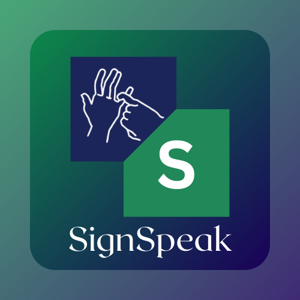

# SignSpeak: AI-Powered Sign Language Interpreter 🤟

<div align="center">
  
  <h3>Breaking communication barriers with real-time sign language translation</h3>

  <!-- Badges -->
  <a href="https://github.com/TeamcodeARC/signspeak/stargazers"></a>
  <a href="https://github.com/TeamcodeARC/signspeak/network/members"></a>
  <a href="https://github.com/TeamcodeARC/signspeak/issues"></a>
  <a href="https://github.com/TeamcodeARC/signspeak/pulls"></a>
  <a href="https://github.com/TeamcodeARC/signspeak/blob/main/LICENSE"></a>
  <a href="https://github.com/sponsors/TeamcodeARC"></a>
  <a href="https://github.com/TeamcodeARC/signspeak/wiki"></a>
  <a href="https://github.com/TeamcodeARC/signspeak/discussions"></a>
  <br/>
  [](https://reactjs.org/)
  [](https://vitejs.dev/)
  [](https://tailwindcss.com/)
  [](https://www.python.org/)
  [](https://flask.palletsprojects.com/)
  [](https://www.tensorflow.org/)
  [](https://developers.google.com/mediapipe)
</div>

---

## 🌟 Features

- **Real-time Hand Tracking & Overlay**: Visualizes hand landmarks directly on the video feed using MediaPipe.
- **Custom-Trained Multi-Model Sign Interpretation**: Uses three custom Keras models (Digit, ASL, ISL) trained on curated datasets for robust sign detection.
- **Automatic Model Selection**: Runs all models and returns the most confident prediction.
- **Text-to-Speech**: Converts recognized signs into speech.
- **Interactive Learning Mode**: Learn sign language with guided lessons and practice sessions.
- **Accessibility**: Dark/light mode, high contrast, responsive design.
- **API-first**: Well-documented REST API (see [`docs/API.md`](docs/API.md)).

## 🖼️ Screenshots

<div align="center">
  
</div>

## 🚀 Getting Started

### Prerequisites

- Node.js 16.x or higher
- npm or yarn
- Python 3.10 or higher (for backend)
- pip (Python package manager)

### Frontend

1. Clone the repository
   ```bash
   git clone https://github.com/TeamcodeARC/signspeak.git
   cd signspeak
   ```

2. Install dependencies
   ```bash
   npm install
   ```

3. Start the development server
   ```bash
   npm run dev
   ```

### Backend

1. Navigate to the backend directory
   ```bash
   cd backend
   ```

2. Create a virtual environment
   ```bash
   python -m venv venv
   ```

3. Activate the virtual environment
   - On Windows: `venv\Scripts\activate`
   - On macOS/Linux: `source venv/bin/activate`

4. Install dependencies
   ```bash
   pip install -r requirements.txt
   ```

5. Start the Flask server
   ```bash
   python app.py
   ```

6. The backend API will be available at `http://localhost:5000`

## 🏗️ Architecture

### Frontend
- **React + Vite**: Modern, fast, and modular
- **TailwindCSS + Shadcn/UI**: Beautiful, accessible UI
- **Framer Motion**: Smooth animations
- **Storybook**: UI component documentation (`src/stories/`)

### Backend
- **Flask**: REST API
- **MediaPipe**: Hand detection and landmark extraction
- **OpenCV**: Image processing
- **TensorFlow/Keras**: Custom-trained models for sign classification
- **gTTS**: Text-to-speech
- **Three Custom Models**: `models/americanSignLanguage.h5`, `models/digitSignLanguage.h5`, `models/indianSignLanguage.h5`
- **Notebook**: [`models/sign-language.ipynb`](backend/models/sign-language.ipynb) for model training and experimentation

## 🤖 Custom-Trained Models

- **Digit Model**: Trained on a dataset of digit signs (0-9)
- **ASL Model**: Trained on American Sign Language alphabet
- **ISL Model**: Trained on Indian Sign Language alphabet
- **Training Notebook**: See [`backend/models/sign-language.ipynb`](backend/models/sign-language.ipynb) for data preprocessing, augmentation, and training code
- **Model Selection**: Backend runs all models and returns the prediction with the highest confidence
- **Easily Extendable**: Add new models or retrain with your own data

## 📊 System Flow


## 📁 Project Structure

```
signspeak/
├── backend/                  # Python Flask backend
│   ├── app.py                # Main Flask application
│   ├── requirements.txt      # Backend dependencies
│   └── models/               # ML models directory
│       ├── americanSignLanguage.h5
│       ├── digitSignLanguage.h5
│       ├── indianSignLanguage.h5
│       └── sign-language.ipynb
├── docs/
│   └── API.md                # API documentation
├── public/                   # Static assets
│   ├── logo.png                 # SignSpeak logo
├── src/
│   ├── App.tsx               # Main React component
│   ├── index.css             # Global styles
│   ├── main.tsx              # Entry point
│   ├── components/           # React components
│   │   ├── home.tsx
│   │   ├── LearningAssistant.tsx
│   │   ├── TranslationPanel.tsx
│   │   ├── WebcamFeed.tsx
│   │   └── ui/               # UI components (shadcn)
│   ├── lib/                  # Utility functions & API clients
│   │   ├── api.ts
│   │   ├── backend-api.ts
│   │   └── utils.ts
│   ├── stories/              # Storybook component stories
│   ├── tempobook/            # Documentation
│   └── types/                # TypeScript types
├── components.json           # shadcn/ui config
├── index.html                # HTML entry point
├── package.json              # Frontend dependencies
├── tailwind.config.js        # Tailwind CSS config
├── tsconfig.json             # TypeScript config
└── vite.config.ts            # Vite build tool config
```

## 🛠️ API Endpoints

See [`docs/API.md`](docs/API.md) for full details and request/response examples.

- **`POST /api/detect-hands`**: Detects hands, returns landmarks and overlay image
- **`POST /api/interpret-sign`**: Interprets sign using all models, returns best result
- **`POST /api/text-to-speech`**: Converts text to speech

## 🤝 Contributing

Contributions are welcome! Please see [`CONTRIBUTING.md`](CONTRIBUTING.md) for guidelines.

## 📝 License

This project is licensed under the MIT License - see the [LICENSE](LICENSE) file for details.

## 🙏 Acknowledgements

- [MediaPipe](https://developers.google.com/mediapipe) for hand tracking
- [TensorFlow/Keras](https://www.tensorflow.org/) for ML
- [Shadcn/UI](https://ui.shadcn.com/) for UI
- [Framer Motion](https://www.framer.com/motion/) for animation
- [OpenCV](https://opencv.org/) for image processing
- [Flask](https://flask.palletsprojects.com/) & [Python](https://www.python.org/)
- [Vite](https://vitejs.dev/) & [React](https://reactjs.org/)

---

<div align="center">
  <p>Made with 💖 by Chirag Nahata, Snigdha Ghosh, Srijita Saha & Rajat Mitra</p>
  <p>Hack4Bengal 4.0</p>
</div>
