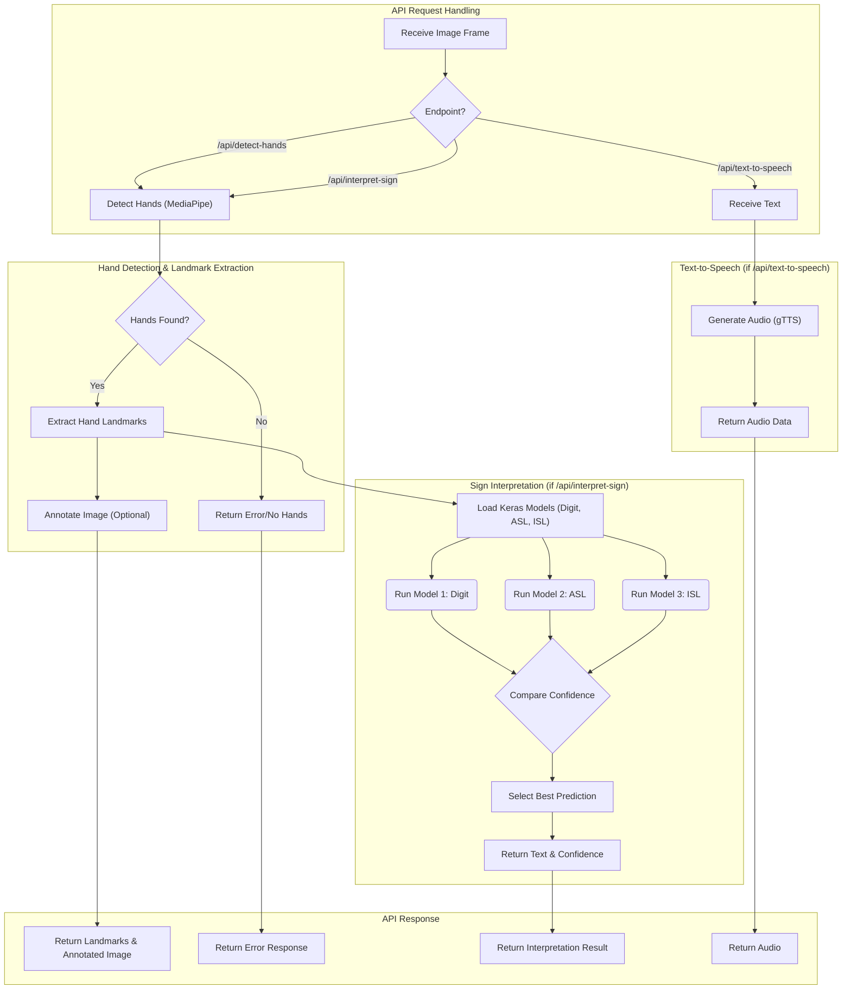

# SignSpeak Backend

## Overview

This backend powers the SignSpeak platform, providing:
- **Hand detection and landmark extraction** using MediaPipe
- **Sign language interpretation** using three custom-trained Keras models (Digit, ASL, ISL)
- **Text-to-speech** using gTTS
- **REST API** for frontend and third-party integration

## Features

- **Custom-trained models**: Models for American Sign Language, Indian Sign Language, and digit signs, trained on curated datasets. See [`models/sign-language.ipynb`](models/sign-language.ipynb) for training details.
- **Multi-model ensemble**: All models are run for each sign, and the most confident prediction is returned.
- **Hand overlay**: Returns annotated images with hand skeletons for visual feedback.
- **API-first**: All features are accessible via REST endpoints.
- **Easy deployment**: Works locally and on cloud platforms (Render, Hugging Face Spaces, etc.)

## File Structure

- `app.py` — Main Flask app, all endpoints
- `requirements.txt` — Python dependencies
- `models/` — Contains `.h5` model files and training notebook
- `README.md` — This file
- `docs/` — API and technical documentation

## API Endpoints

See [`../docs/API.md`](../docs/API.md) for full details.

- `POST /api/detect-hands` — Detects hands, returns landmarks and overlay image
- `POST /api/interpret-sign` — Interprets sign using all models, returns best result
- `POST /api/text-to-speech` — Converts text to speech

## 📊 Backend Flowchart



## Custom Model Details

- **americanSignLanguage.h5**: ASL alphabet, trained on [source dataset or your own]
- **digitSignLanguage.h5**: Digits 0-9, trained on [source dataset or your own]
- **indianSignLanguage.h5**: ISL alphabet, trained on [source dataset or your own]
- **Training notebook**: [`models/sign-language.ipynb`](models/sign-language.ipynb)

## Running Locally

1. Create a virtual environment (recommended):
   ```bash
   python -m venv venv
   venv\Scripts\activate  # On Windows
   # or
   source venv/bin/activate  # On macOS/Linux
   ```
2. Install dependencies:
   ```bash
   pip install -r requirements.txt
   ```
3. Place model files in the `models/` directory (already present).
4. Run the server:
   ```bash
   python app.py
   ```

## Documentation

- [API Reference](../docs/API.md)
- [Wiki](https://github.com/yourusername/signspeak/wiki)
- [Discussions](https://github.com/yourusername/signspeak/discussions)

## Contributing

See [CONTRIBUTING.md](../CONTRIBUTING.md).

## License

This project is licensed under the MIT License - see the [LICENSE](LICENSE) file for details.