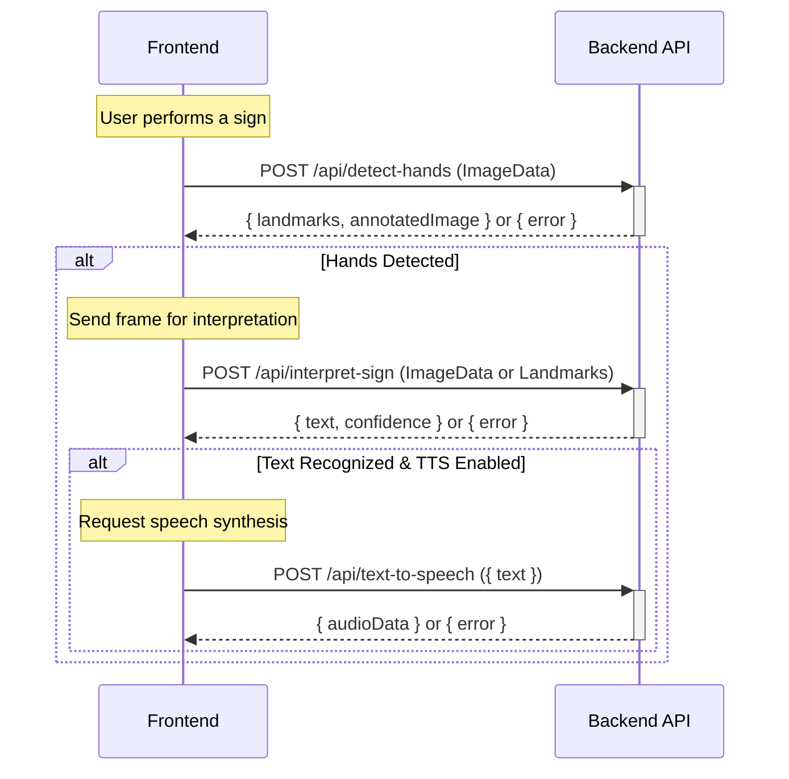

# SignSpeak API Documentation

## Overview

This document describes the REST API endpoints provided by the SignSpeak backend. All endpoints accept and return JSON unless otherwise specified.

---

## API Interaction Flow



---

## Base URL

```
http://localhost:5000/api
```

---

## Endpoints

### 1. Detect Hands

- **URL:** `/api/detect-hands`
- **Method:** `POST`
- **Request Body:**
  ```json
  {
    "image": "data:image/jpeg;base64,..."
  }
  ```
- **Response Body:**
  ```json
  {
    "handsDetected": true,
    "numHands": 1,
    "handLandmarks": [
      [
        {"x": 0.5, "y": 0.5, "z": 0.0},
        ...
      ]
    ],
    "annotatedImage": "data:image/png;base64,..."
  }
  ```
- **Description:**
  Detects hands in the image using MediaPipe. Returns landmark coordinates and an annotated image with hand skeleton overlay.

---

### 2. Interpret Sign

- **URL:** `/api/interpret-sign`
- **Method:** `POST`
- **Request Body:**
  ```json
  {
    "image": "data:image/jpeg;base64,..."
  }
  ```
- **Response Body:**
  ```json
  {
    "text": "A",
    "confidence": 0.98,
    "model": "asl"
  }
  ```
- **Description:**
  Runs all custom-trained models (Digit, ASL, ISL) and returns the prediction with the highest confidence.

---

### 3. Text to Speech

- **URL:** `/api/text-to-speech`
- **Method:** `POST`
- **Request Body:**
  ```json
  {
    "text": "Hello",
    "language": "en"
  }
  ```
- **Response Body:**
  ```json
  {
    "audio": "data:audio/mpeg;base64,..."
  }
  ```
- **Description:**
  Converts the provided text to speech using gTTS and returns the audio as a base64-encoded MP3.

---

## Error Handling

All endpoints return appropriate HTTP status codes and a JSON error message on failure:
```json
{
  "error": "Description of the error."
}
```

---

## Model Details

- **americanSignLanguage.h5**: ASL alphabet
- **digitSignLanguage.h5**: Digits 0-9
- **indianSignLanguage.h5**: ISL alphabet
- **See training notebook:** [`../backend/models/sign-language.ipynb`](../backend/models/sign-language.ipynb)

---

## See Also

- [Project README](../README.md)
- [Backend README](../backend/README.md)
- [Wiki](https://github.com/yourusername/signspeak/wiki)
- [Discussions](https://github.com/yourusername/signspeak/discussions)
- [Contributing Guide](../CONTRIBUTING.md)